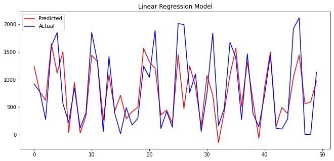
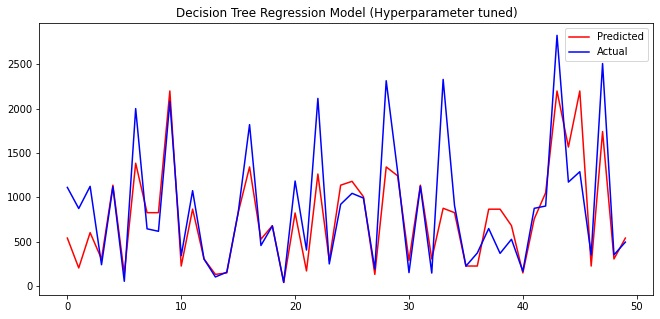
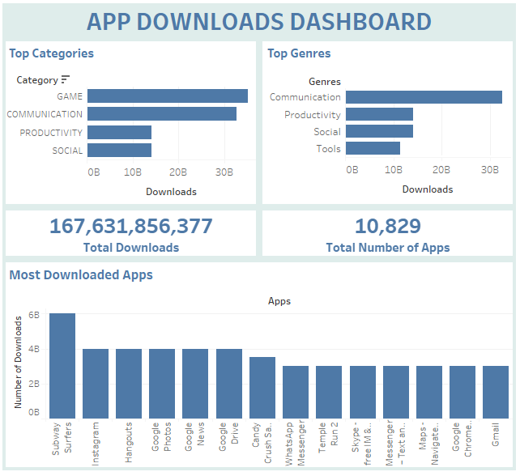

## Nihal Habeeb's Projects

### RENTAL BIKE DEMAND PREDICTION
For a bike renting system to smoothly function, it is necessary to provide a stable supply of rental bikes at any given point of time according to the demand. This requires having a good prediction of the bike demand at each hour. I am working with a dataset of bike rental counts in the city of Seoul, South Korea which contains historical data on date and weather information (Temperature, Humidity, Windspeed, Visibility, Dewpoint, Solar radiation, Snowfall, Rainfall).

#### Project Overview
* The distributions of the features as well as their relationship with the rented bike count is explored.
* Linear regression model is trained on the data to make predictions and its performance is evaluated.
* Decision Tree Regression model is trained for getting better predictions and this model's performance is evaluated as well.
* Python libraries such as Matplotlib, Seaborn, Pandas and Scikit-learn are used.

Access the complete project [HERE](https://nihalhabeeb.github.io/rental_bike_demand_prediction/)

##### Linear Regression Model - Predicted and Actual values

##### Decision Tree Regression Model - Predicted and Actual values

### PLAYSTORE DATA ANALYSIS
#### Project Overview
* In this project, the distribution of applications in relation to categories and genres and whether they're paid or free is explored.
* Information on the money spent by consumers buying applications, as well as the review activities are obtained.
* Derived conclusions can help app developers gain an understanding on how to capture the market.
* PostgreSQL and Tableau are the tools used.

Access the complete project [HERE](https://nihalhabeeb.github.io/Playstore_data_analysis/)

##### App Downloads Dashboard:

<!-- For more details see [Basic writing and formatting syntax](https://docs.github.com/en/github/writing-on-github/getting-started-with-writing-and-formatting-on-github/basic-writing-and-formatting-syntax).

### Jekyll Themes

Your Pages site will use the layout and styles from the Jekyll theme you have selected in your [repository settings](https://github.com/nihalhabeeb/nihalhabeeb.github.io/settings/pages). The name of this theme is saved in the Jekyll `_config.yml` configuration file.

### Support or Contact

Having trouble with Pages? Check out our [documentation](https://docs.github.com/categories/github-pages-basics/) or [contact support](https://support.github.com/contact) and we’ll help you sort it out. -->
