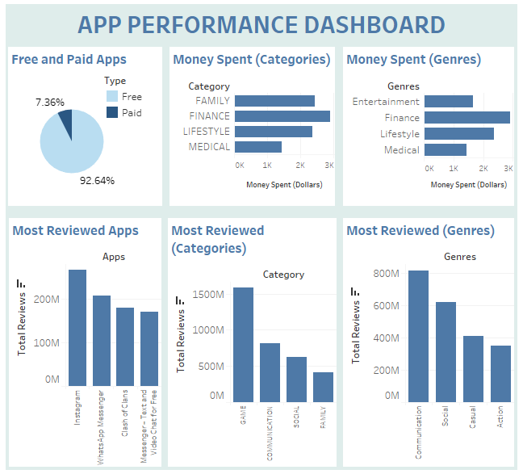

## Nihal Habeeb's Projects

Hello this is my portfolio

### Playstore Data Analysis
#### Project Overview
* In this project, the distribution of applications in relation to categories and genres and whether they're paid or free is explored.
* Information on the money spent by consumers buying applications, as well as the review activities are obtained.
* Derived conclusions can help app developers gain an understanding on how to capture the market.
* PostgreSQL and Tableau are the tools used.

Data was obtained from googleplaystore.csv dataset taken from kaggle (Author: Lavanya, Updated on 03/02/2019). To acess the source [CLICK HERE](https://www.kaggle.com/lava18/google-play-store-apps):

## Data Visualisation
Data visualisation was done in Tableau. The dashboards were created.

### App Downloads Dashboard:
Presents the distribution of application downloads across categories and genres. Provides information on the total download activity as well as the total number of applications (Link below).
https://public.tableau.com/views/APPPERFORMANCEDASHBOARD/appperf_db?:language=en-US&publish=yes&:display_count=n&:origin=viz_share_link


### App Performance Dashboard:
Visualises the distribution of free and paid apps as well as the money spent across categories and genres. The relation of review activities with categories and genres is explored as well (Link below).

https://public.tableau.com/views/APPPERFORMANCEDASHBOARD/appperf_db?:language=en-US&publish=yes&:display_count=n&:origin=viz_share_link




I will talk about my first project

```markdown
I can put my code block inside this

# Header 1
## Header 2
### Header 3

* Bulleted
* List

1. Numbered
2. List

**Bold** and _Italic_ and `Code` text

[Link](url) and 
```

For more details see [Basic writing and formatting syntax](https://docs.github.com/en/github/writing-on-github/getting-started-with-writing-and-formatting-on-github/basic-writing-and-formatting-syntax).

### Jekyll Themes

Your Pages site will use the layout and styles from the Jekyll theme you have selected in your [repository settings](https://github.com/nihalhabeeb/nihalhabeeb.github.io/settings/pages). The name of this theme is saved in the Jekyll `_config.yml` configuration file.

### Support or Contact

Having trouble with Pages? Check out our [documentation](https://docs.github.com/categories/github-pages-basics/) or [contact support](https://support.github.com/contact) and we’ll help you sort it out.
